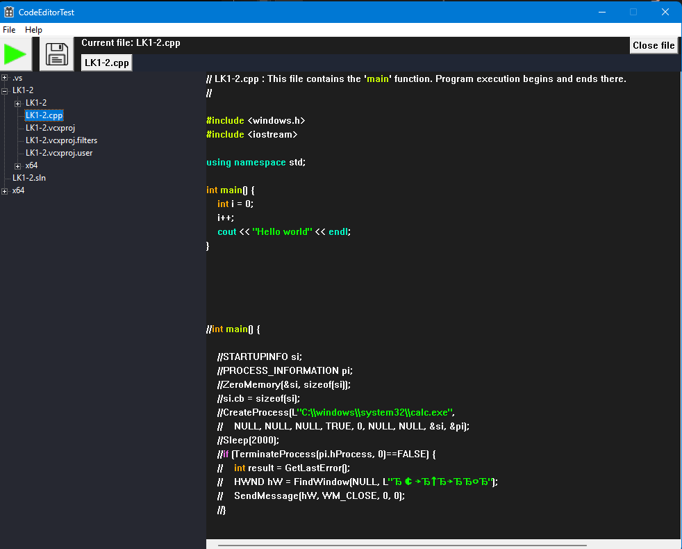
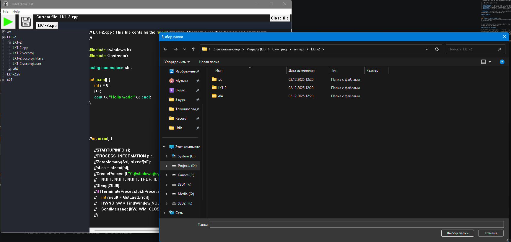

# CodeEditor — редактор кода на Win32 API

Простой редактор кода для Windows с поддержкой компиляции, написанный "с нуля" —
без сторонних GUI-фреймворков, напрямую через функции Win32 API.



## Результат

- Полноценное окно редактора с подсветкой кода, кареткой, прокруткой и вводом текста
- Выделение текста мышью, клавиатурой и сочетанием `Ctrl+A`; копирование, замена,
  удаление выделенного
- Файловый провидник — просмотр содержимого директории и открытие файлов по клику
- Меню управления: открытие/сохранение/закрытие файлов, переключение между
  несколькими открытыми файлами
- Компиляция и запуск кода прямо из редактора



## Технологии

`C++` · `Win32 API (WinAPI)` · `Microsoft Visual Studio`

## Архитектура

Приложение построено из четырёх независимых компонентов:

| Компонент | Назначение |
|---|---|
| `EditorTextBox` | текстовый редактор — ввод, подсветка, выделение текста |
| `FileExplorer` | отображение содержимого директории, открытие файлов |
| `EditorMenu` | навигация, сохранение/открытие/закрытие файлов, компиляция |
| `FileManager` | связующее звено — чтение/запись файлов, запуск компиляции |

`FileManager` не взаимодействует с пользователем напрямую — он объединяет
функциональность остальных компонентов.

## Как запустить

```bash
git clone <ссылка на репозиторий>
# Открыть решение (.sln) в Microsoft Visual Studio
# Build → Run (F5)
```

Требуется Windows и установленный компилятор (например MinGW/MSVC) для функции
компиляции кода из редактора.

## Особенности реализации

Win32 API требует функционального стиля программирования — оконные процедуры,
message loop, глобальные/статические переменные для хранения состояния. Основная
инженерная задача проекта — организовать это в понятную структуру из четырёх
условно независимых компонентов, каждый из которых можно разрабатывать и
тестировать через фиктивный интерфейс до интеграции с остальными.

## Возможные доработки

- Подсветка синтаксиса для нескольких языков
- Работа с проектами (не только с отдельными файлами)
- Встроенный вывод ошибок компиляции с переходом к строке
